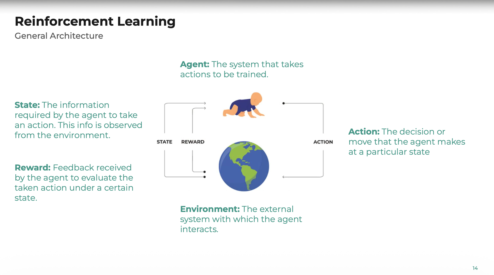

# REVISION COMPLETE - Reinforcement Learning (EFREI)

## Guide de lecture

Chaque notion est classée en **TIER** (S > A > B > C) selon le ratio **temps d'apprentissage / probabilité d'apparition à l'examen**.

- **TIER S** : Apprendre EN PREMIER. Quasi-certain de tomber. Facile à apprendre, gros gain de points.
- **TIER A** : Apprendre EN SECOND. Très probable. Définitions courtes, 1pt chacune.
- **TIER B** : Apprendre ENSUITE. Probable. Demande un peu plus de compréhension.
- **TIER C** : Apprendre SI TEMPS RESTANT. Possible ou bonus.

## Index des sources (noms abrégés → fichiers)

| Abréviation dans les références | Fichier complet |
|------|------|
| `1 - Introduction to RL and MDPs .pdf` | Slides du cours 1 — Intro RL + MDPs (79 slides) |
| `1 - Fiche MDP.pdf` | Fiche de cours MDP — Thomas Bonald (4 pages) |
| `2 - Dynamic Programming (DP).pdf` | Slides du cours 2 — Programmation Dynamique (51 slides) |
| `Notes-2-dynamicProgramming.pdf` | Fiche de cours DP — Thomas Bonald (4 pages) |
| `3 - Model-Free Prediction  Control.pdf` | Slides du cours 3 — MC, TD, SARSA, Q-Learning (57 slides) |
| `Notes-3-prediction.pdf` | Fiche de cours Prediction — Thomas Bonald (2 pages) |
| `Notes-4-control.pdf` | Fiche de cours Control — Thomas Bonald (4 pages) |
| `5 - Policy-Gradient and Actor-Critic Methods-1.pdf` | Slides du cours 5 — Policy Gradient, REINFORCE, A2C (54 slides) |
| `6 - Deep RL.pdf` | Slides du cours 6 — DQN, TD3, SAC, PPO, Model-Based (27 slides) |
| `7 - Modern Applications.pdf` | Slides du cours 7 — RLHF, GRPO, Drones (16 slides) |

> Les numéros de "slides" correspondent aux numéros de pages du PDF (ex: slide 14 = page 14 du PDF).

---

---

# TIER S — PRIORITE ABSOLUE (~20 pts, 30 min d'apprentissage)

---

## S1. Le schéma général du RL (3 pts)

> 📖 **Sources** : `1 - Introduction to RL and MDPs .pdf` slides 11, 14 │ `3 - Model-Free Prediction  Control.pdf` slide 4

C'est LA question d'ouverture quasi-garantie. Il faut savoir le dessiner et nommer chaque élément.



**Boucle à chaque pas de temps t :**
1. L'agent observe l'état S(t) et reçoit la récompense R(t)
2. L'agent choisit et exécute l'action A(t)
3. L'environnement reçoit A(t), produit le nouvel état S(t+1) et la récompense R(t+1)
4. t ← t+1, on recommence

**Les 5 variables à définir :**

| Variable | Définition |
|----------|-----------|
| **Agent** | Le système qui prend des décisions séquentielles pour maximiser ses récompenses |
| **Environnement** | Le système externe avec lequel l'agent interagit ; il produit états et récompenses |
| **État S(t)** | Description complète de la situation actuelle de l'environnement, observée par l'agent |
| **Action A(t)** | La décision ou mouvement effectué par l'agent dans un état donné |
| **Récompense R(t)** | Signal numérique de feedback évaluant la qualité de l'action prise dans un état |

**🐕 Analogie — Pense à un chien qu'on dresse :**
- Le chien = **Agent**
- Le monde autour = **Environnement**
- Ce qu'il voit (balle, maître) = **État**
- Ce qu'il fait (s'asseoir, courir) = **Action**
- Le biscuit ou le "non !" = **Récompense**

Le chien apprend progressivement à faire les bonnes actions pour maximiser ses biscuits. C'est exactement le RL.

> **Astuce examen** : Dessine le schéma en premier, puis légende chaque flèche et chaque bloc. C'est 3 pts faciles.

---

## S2. Définition d'un MDP (1 pt)

> 📖 **Sources** : `1 - Fiche MDP.pdf` §1 p.1 │ `1 - Introduction to RL and MDPs .pdf` slides 28-29, 42-44

Un **Markov Decision Process** est le cadre mathématique standard du RL.

**Définition** : Un MDP est un tuple **(S, A, P, R, γ)** où :
- **S** : ensemble (fini) d'états
- **A** : ensemble (fini) d'actions (A(s) = actions disponibles dans l'état s)
- **P** : probabilités de transition → p(s'|s, a) = probabilité d'aller en s' depuis s en faisant a
- **R** : fonction de récompense → p(r|s, a) = distribution de la récompense
- **γ** : facteur d'actualisation (discount factor)

**Propriété de Markov** : L'état futur ne dépend **que** de l'état présent et de l'action, **pas** de l'historique.

> P(S(t+1) | S(t), A(t)) = P(S(t+1) | S(0), S(1), ..., S(t), A(t))

**🎲 Analogie — Jeu d'échecs :**
- **S** = toutes les positions possibles du plateau
- **A** = tous les coups légaux
- **P** = le coup mène à une position précise (déterministe ici)
- **R** = +1 si victoire, -1 si défaite, 0 sinon
- **Propriété de Markov** : pour décider du prochain coup, il suffit de regarder le plateau actuel, pas besoin de savoir comment on en est arrivé là

---

## S3. Les 3 définitions V, Q, G (3 pts)

> 📖 **Sources** : `1 - Fiche MDP.pdf` §3 p.2 (V, G) │ `1 - Introduction to RL and MDPs .pdf` slides 18-21 (V, G), slide 48 (Q) │ `Notes-4-control.pdf` §1 p.1 (Q)

### Gain G (cumulative discounted reward)

> G(t) = r(t) + γ·r(t+1) + γ²·r(t+2) + ... = Σ(k=0→∞) γᵏ · r(t+k)

C'est la somme pondérée des récompenses futures à partir du temps t.

### Value Function V (state-value function)

> V^π(s) = E[G(t) | S(t) = s]    (sous la politique π)

L'espérance du gain en partant de l'état s, en suivant la politique π.

### Action-Value Function Q

> Q^π(s, a) = E[G(t) | S(t) = s, A(t) = a]    (sous la politique π)

L'espérance du gain en partant de l'état s, en prenant l'action a, puis en suivant π.

**Lien entre V et Q** :
- V^π(s) = Σ_a π(a|s) · Q^π(s, a)    (V est la moyenne de Q sur les actions)
- Q^π(s, a) = E[r + γ·V^π(s') | s, a]    (Q est la récompense + V de l'état suivant)

**🧭 Analogie — GPS dans une ville :**
- **G** = le temps total restant pour arriver à destination (somme de tous les trajets restants)
- **V(s)** = "à quel point cet endroit est bien situé ?" → être en centre-ville = V élevé (près de tout), être en banlieue loin = V faible
- **Q(s, a)** = "si je suis ici ET que je prends cette rue, c'est bien ?" → Q(centre-ville, aller à gauche) peut être différent de Q(centre-ville, aller à droite)

---

## S4. Discount Factor γ (1 pt)

> 📖 **Sources** : `1 - Introduction to RL and MDPs .pdf` slides 20, 36-37 │ `1 - Fiche MDP.pdf` §3 p.2

**Définition** : γ ∈ [0, 1] pondère l'importance des récompenses futures vs immédiates.

**A quoi sert-il ?**
1. γ = 0 → l'agent est **myope**, ne regarde que la récompense immédiate
2. γ → 1 → l'agent est **prévoyant**, valorise autant le futur que le présent
3. Quand il n'y a pas d'état terminal, γ < 1 **garantit la convergence** du gain G (sinon somme infinie)

**💰 Analogie — Argent dans le temps :**
Préfères-tu 100€ aujourd'hui ou 100€ dans 1 an ? Évidemment aujourd'hui. C'est pareil pour l'agent : γ = 0.9 signifie que 100€ dans 1 an ne valent que 90€ aujourd'hui. Plus γ est petit, plus l'agent est impatient.

---

## S5. Politique π (revient partout)

> 📖 **Sources** : `1 - Fiche MDP.pdf` §2 p.1-2 │ `1 - Introduction to RL and MDPs .pdf` slides 17, 25, 45-46, 61

**Déterministe** : a = π(s) → une action précise pour chaque état

**Stochastique** : π(a|s) = P(A=a | S=s) → distribution de probabilité sur les actions

> Σ_a π(a|s) = 1 pour tout état s

**Politique optimale π*** : celle qui maximise V(s) pour TOUT état s.

> π*(s) = argmax_a Q*(s, a)

**🚗 Analogie — Conduite :**
- **Politique déterministe** : "Au feu rouge, je freine TOUJOURS" → une seule action par situation
- **Politique stochastique** : "Au feu orange, 70% du temps je freine, 30% je passe" → une distribution de probabilité
- **Politique optimale** : le conducteur parfait qui prend toujours la meilleure décision dans chaque situation

---

## S6. Équation de Bellman (2+ pts)

> 📖 **Sources** : `1 - Fiche MDP.pdf` §4 p.2-3 (équation + preuve) │ `1 - Introduction to RL and MDPs .pdf` slides 32-33, 50-54 │ `Notes-2-dynamicProgramming.pdf` §2 p.1 (Bellman optimality) │ `Notes-4-control.pdf` §1 p.1 (Bellman pour Q)

C'est L'EQUATION CENTRALE du cours. Elle revient sous toutes les formes.

### Bellman Expectation (pour une politique π donnée)

> V^π(s) = E[r(0) + γ·V^π(s(1)) | s(0) = s]

Forme développée :
> V^π(s) = Σ_a π(a|s) [ Σ_r r·p(r|s,a) + γ · Σ_s' p(s'|s,a) · V^π(s') ]

**Interprétation** : La valeur d'un état = récompense immédiate + γ × valeur de l'état suivant.

### Bellman Optimality (pour la politique optimale)

> V*(s) = max_a E[r(0) + γ·V*(s(1)) | s(0) = s, a(0) = a]

Pour Q :
> Q*(s, a) = E[r + γ · max_a' Q*(s', a') | s, a]

**Pourquoi c'est utile** : Elle transforme un problème global (optimiser sur toute la trajectoire) en sous-problèmes locaux (optimiser état par état), ce qui est la base de TOUS les algorithmes du cours.

**🏠 Analogie — Prix d'un appartement :**
La valeur d'un appart (état) = le loyer que tu touches ce mois (récompense immédiate) + γ × la valeur de l'appart le mois prochain (valeur future). Tu n'as pas besoin de calculer tous les loyers sur 50 ans, il suffit de connaître le loyer actuel et la valeur au mois suivant. C'est la récursion de Bellman.

### Savoir l'appliquer (exercice de calcul)

Exemple type : 2 états s1, s2, une action, γ = 0.9
- Depuis s2 : on reste en s2, récompense 3 → V(s2) = 3 + 0.9·V(s2) → V(s2) = 30
- Depuis s1 : on va en s2, récompense 5 → V(s1) = 5 + 0.9·V(s2) = 5 + 27 = 32

> Méthode : écrire l'équation de Bellman pour chaque état, résoudre le système linéaire.

---

## S7. Pseudo-code d'un algorithme DP (3 pts)

> 📖 **Sources** : `2 - Dynamic Programming (DP).pdf` slides 10-16 (Policy Eval), 17-35 (Policy Iteration), 37-47 (Value Iteration), slide 48 (tableau récap) │ `Notes-2-dynamicProgramming.pdf` §3 p.2 (Policy Iteration), §4 p.3 (Value Iteration)

Il faut en connaître AU MOINS UN par coeur. Value Iteration est le plus simple.

### Value Iteration (recommandé, plus court)

```
Entrée : MDP (S, A, P, R, γ)
Initialiser V(s) = 0 pour tout s
Répéter jusqu'à convergence (|ΔV| < seuil) :
    Pour chaque état s ∈ S :
        V(s) ← max_a [ Σ_r r·p(r|s,a) + γ · Σ_s' p(s'|s,a) · V(s') ]

Extraire la politique optimale :
    π*(s) = argmax_a [ Σ_r r·p(r|s,a) + γ · Σ_s' p(s'|s,a) · V(s') ]
Retourner V*, π*
```

### Policy Iteration (alternative)

```
Entrée : MDP (S, A, P, R, γ)
Initialiser π(s) arbitrairement pour tout s
Répéter jusqu'à stabilité de π :
    1. POLICY EVALUATION :
       Répéter jusqu'à convergence :
           Pour chaque s :
               V(s) ← Σ_r r·p(r|s,π(s)) + γ · Σ_s' p(s'|s,π(s)) · V(s')

    2. POLICY IMPROVEMENT :
       Pour chaque s :
           π(s) ← argmax_a [ Σ_r r·p(r|s,a) + γ · Σ_s' p(s'|s,a) · V(s') ]
Retourner V_π, π
```

### Tableau récapitulatif DP (à connaître)

| Algorithme | Objectif | Équation utilisée |
|-----------|----------|-------------------|
| Policy Evaluation | Calculer V^π pour un π fixé | Bellman Expectation |
| Policy Iteration | Trouver π* | Bellman Expectation + Greedy Improvement |
| Value Iteration | Trouver V* et π* | Bellman Optimality |

**🗺️ Analogie — Labyrinthe :**
Imagine un labyrinthe de 4 cases. Au départ, tu ne sais pas quelle case est bonne (V = 0 partout). À chaque itération de Value Iteration, tu mets à jour la valeur de chaque case : "si je suis ici et que je prends la meilleure direction, quelle récompense j'obtiens + quelle est la valeur de la case suivante ?" Après quelques tours, les valeurs se stabilisent et tu sais exactement quel chemin prendre depuis n'importe quelle case.

---

## S8. Les 4 grandes dichotomies (4 pts, 1 pt chacune)

### Model-Free vs Model-Based

> 📖 **Sources** : `1 - Introduction to RL and MDPs .pdf` slide 23 │ `5 - Policy-Gradient and Actor-Critic Methods-1.pdf` slide 4

| Model-Free | Model-Based |
|-----------|-------------|
| Apprend DIRECTEMENT par interaction | Construit ou utilise un MODELE de l'environnement |
| N'a PAS besoin de connaître P ni R | A besoin de P et R (connus ou appris) |
| + Applicable quand le modèle est inconnu | + Meilleure sample efficiency (planification) |
| - Nécessite beaucoup de données | - Le modèle peut être inexact (erreurs cumulées) |
| Ex: Q-Learning, SARSA, PPO | Ex: Value Iteration, AlphaZero, MuZero |

**🍳 Analogie — Apprendre à cuisiner :**
- **Model-Free** : tu goûtes tes plats (interaction) et tu apprends par essai-erreur, sans recette. "La dernière fois j'ai mis trop de sel, j'en mets moins."
- **Model-Based** : tu as un livre de recettes (modèle) qui te dit exactement "200g de farine + 3 oeufs = crêpe". Tu peux planifier ton repas avant de toucher une casserole.

### Value-Based vs Policy-Based

> 📖 **Sources** : `1 - Introduction to RL and MDPs .pdf` slide 23 │ `5 - Policy-Gradient and Actor-Critic Methods-1.pdf` slides 4, 9-10, 51

| Value-Based | Policy-Based |
|-------------|-------------|
| Apprend V(s) ou Q(s,a) | Apprend directement π(a\|s) |
| La politique est DÉRIVÉE de la valeur (greedy) | PAS de fonction de valeur explicite |
| Fonctionne bien en discret | Fonctionne en continu et discret |
| Peut avoir du mal en actions continues | Peut converger vers un optimum local |
| Ex: Q-Learning, DQN, SARSA | Ex: REINFORCE, PPO, TRPO |

> **Actor-Critic** = les deux : une politique (actor) + une fonction de valeur (critic)
> Ex: A2C, PPO, SAC, TD3

**🎮 Analogie — Jeu vidéo :**
- **Value-Based** : tu calcules un score pour chaque case de la carte ("cette zone vaut 50 points"), puis tu vas toujours vers la meilleure case → tu n'as pas de "plan", juste des scores
- **Policy-Based** : tu apprends directement une stratégie ("dans cette situation, fais telle action") sans forcément savoir le score de chaque zone

### On-Policy vs Off-Policy

> 📖 **Sources** : `3 - Model-Free Prediction  Control.pdf` slides 44-51 │ `Notes-4-control.pdf` §3 p.2 (SARSA on-policy), §4 p.3 (Q-Learning off-policy)

| On-Policy | Off-Policy |
|-----------|-----------|
| Apprend la valeur de la politique QU'IL SUIT | Apprend la valeur d'une AUTRE politique |
| Politique cible = politique de comportement | Politique cible ≠ politique de comportement |
| Les données doivent être "fraîches" | Peut réutiliser d'anciennes données (replay buffer) |
| Ex: SARSA, A2C, PPO | Ex: Q-Learning, DQN, SAC, TD3 |

**Moyen mnémotechnique SARSA vs Q-Learning :**
- SARSA : Q(s,a) ← ... + γ·Q(s', **a'**) → a' = action RÉELLEMENT prise → **on-policy**
- Q-Learning : Q(s,a) ← ... + γ·**max_a'** Q(s', a') → prend le max → **off-policy**

**📚 Analogie — Apprendre en cours :**
- **On-Policy** : tu apprends uniquement de TES propres erreurs en TP. Tu fais un exercice, tu te trompes, tu corriges. Tes notes ne servent qu'à toi.
- **Off-Policy** : tu regardes les copies corrigées d'AUTRES étudiants (même des anciens) pour apprendre de leurs erreurs aussi. Tu réutilises les expériences des autres.

### TD vs Monte Carlo

> 📖 **Sources** : `3 - Model-Free Prediction  Control.pdf` slides 11, 14-19 (MC), 24-27 (TD), 25-26 (comparaison), 55-57 (summary) │ `Notes-3-prediction.pdf` §1 p.1 (MC), §2 p.2 (TD)

| Temporal Difference (TD) | Monte Carlo (MC) |
|--------------------------|------------------|
| Met à jour à **chaque pas** | Met à jour en **fin d'épisode** |
| Utilise le **bootstrapping** (estimation → estimation) | Utilise le **retour complet** G(t) |
| **Biaisé** (dépend de l'estimation courante) | **Non biaisé** (moyenne des vrais retours) |
| **Faible variance** | **Haute variance** |
| Converge **plus vite** en général | Nécessite des **épisodes complets** |
| Fonctionne en environnement **continu** | Uniquement environnements **épisodiques** |

Règles de mise à jour :
- **MC** : V(s) ← V(s) + α·[**G(t)** - V(s)]
- **TD(0)** : V(s) ← V(s) + α·[**r + γ·V(s')** - V(s)]

> La différence clé : MC attend le vrai retour G, TD utilise r + γV(s') comme estimation.

**🏃 Analogie — Estimer ton temps au marathon :**
- **Monte Carlo** : tu cours le marathon EN ENTIER, tu regardes ton chrono final, et tu dis "ok mon niveau c'est 4h12". Précis mais il faut finir la course.
- **TD** : après chaque kilomètre, tu estimes ton temps final : "j'ai fait le km 1 en 5min, et d'habitude mon temps total c'est X, donc je recalcule". Moins précis mais tu ajustes en temps réel, sans attendre la fin.

---

---

# TIER A — TRES RENTABLE (~10 pts, 20 min)

---

## A1. Exploration vs Exploitation (1-2 pts)

> 📖 **Sources** : `1 - Introduction to RL and MDPs .pdf` slides 75-77 │ `3 - Model-Free Prediction  Control.pdf` slides 5-8 (dilemme), 35-38 (ε-greedy, softmax, roulette)

**Le dilemme** :
- **Exploration** : essayer des actions inconnues pour découvrir de meilleures stratégies
- **Exploitation** : choisir les actions connues comme les meilleures pour maximiser le gain immédiat

**Problème** : Trop d'exploration = on perd du temps. Trop d'exploitation = on reste coincé sur une solution sous-optimale.

**Stratégies principales :**

| Stratégie | Principe | Avantages | Inconvénients |
|-----------|----------|-----------|---------------|
| **ε-greedy** | Avec proba (1-ε) : meilleure action connue. Avec proba ε : action aléatoire | Simple, garantit l'exploration | Explore uniformément (même les mauvaises actions) |
| **Softmax / Boltzmann** | Probabilité proportionnelle à exp(Q(s,a)/τ) | Favorise les bonnes actions même en explorant | Sensible au paramètre τ |
| **UCB** | Choisit l'action qui maximise Q(s,a) + bonus d'incertitude | Explore intelligemment les actions mal connues | Plus complexe |

**ε-greedy en détail (le plus demandé)** :
```
Avec probabilité (1 - ε) : a = argmax_a Q(s, a)     ← exploitation
Avec probabilité ε       : a = action aléatoire       ← exploration
```
On peut faire décroître ε au fil du temps : on explore beaucoup au début, puis de moins en moins.

**🍕 Analogie — Choisir un restaurant :**
- **Exploitation** : tu retournes toujours à ta pizzeria préférée (valeur sûre)
- **Exploration** : tu essaies un nouveau restaurant coréen (risque mais potentiel de découverte)
- **ε-greedy** : 90% du temps tu vas à ta pizzeria, 10% du temps tu testes un truc nouveau. Au fil des années, tu baisses le ε car tu connais bien les restos du quartier.

---

## A2. Bootstrapping (1 pt)

> 📖 **Sources** : `3 - Model-Free Prediction  Control.pdf` slides 24-27 │ `Notes-3-prediction.pdf` §2 p.2

**Définition** : Mettre à jour une estimation en utilisant **une autre estimation** (et non la valeur réelle).

**En TD** : V(s) ← V(s) + α·[r + γ·**V(s')** - V(s)]

Le terme **V(s')** est lui-même une estimation (pas la vraie valeur). C'est du bootstrapping.

**En MC** : V(s) ← V(s) + α·[**G(t)** - V(s)]

G(t) est le vrai retour observé. Il n'y a **PAS** de bootstrapping en MC.

**Conséquence** : Le bootstrapping introduit un **biais** (on se fie à nos propres estimations) mais **réduit la variance** (on n'attend pas la fin de l'épisode).

**🔄 Analogie — Estimer la note d'un film :**
- **Sans bootstrapping (MC)** : tu regardes le film EN ENTIER, puis tu donnes ta note. C'est précis, mais il faut attendre la fin.
- **Avec bootstrapping (TD)** : après 20 minutes tu te dis "vu le début, ça ressemble à un film que j'ai noté 7/10, donc pour l'instant j'estime 7". Tu utilises ta propre estimation d'un autre film (bootstrapping) pour juger celui-ci avant de l'avoir fini.

---

## A3. Actor-Critic (1 pt)

> 📖 **Sources** : `5 - Policy-Gradient and Actor-Critic Methods-1.pdf` slides 4 (taxonomie), 41-49 (A2C, advantage, computation) │ `6 - Deep RL.pdf` slides 4-6 (summary deep RL)

**Définition** : Architecture combinant deux composants :

- **Actor (Acteur)** : apprend la politique π_θ → "quelle action prendre ?"
- **Critic (Critique)** : apprend la fonction de valeur V ou Q → "cette action est-elle bonne ?"

**Fonctionnement** :
1. L'actor choisit une action selon π_θ
2. Le critic évalue cette action (via V ou Q)
3. L'actor est mis à jour selon le feedback du critic (via la fonction avantage)

**Fonction Avantage** : A(s, a) = Q(s, a) - V(s)
- A > 0 → l'action est meilleure que la moyenne → renforcer
- A < 0 → l'action est pire que la moyenne → décourager

Exemples : A2C, A3C, PPO, SAC, TD3

**🎬 Analogie — Tournage d'un film :**
- **Actor** = l'acteur qui joue la scène (prend les décisions)
- **Critic** = le réalisateur qui dit "C'était bien !" ou "On refait, c'était nul" (évalue la performance)
- L'acteur s'améliore grâce aux retours du réalisateur. Sans réalisateur (REINFORCE pur), l'acteur doit juger seul → beaucoup plus de temps pour s'améliorer.

---

## A4. Replay Buffer (1 pt)

> 📖 **Sources** : `6 - Deep RL.pdf` slide 8 (TD3, mentionne replay buffer) │ Concept implicite dans DQN et tous les algos off-policy du cours

**Définition** : Une mémoire (file/buffer) qui stocke les transitions (s, a, r, s') passées.

**Principe** : Au lieu d'apprendre uniquement sur la dernière expérience, on tire aléatoirement un mini-batch de transitions depuis le buffer.

**Pourquoi l'utiliser ?**
1. **Casse la corrélation temporelle** : les transitions consécutives sont corrélées, le tirage aléatoire supprime cette corrélation → stabilise l'apprentissage
2. **Réutilise les données** : chaque transition peut être utilisée plusieurs fois → meilleure sample efficiency
3. **Indispensable pour le off-policy** : permet d'apprendre à partir de données collectées par d'anciennes politiques

> Utilisé dans : DQN, SAC, TD3, DDPG. PAS utilisé dans : PPO, A2C (on-policy).

**📓 Analogie — Carnet de notes d'un étudiant :**
Le replay buffer, c'est comme si tu gardais un carnet avec toutes tes erreurs passées (interro, TP, exercices). Au lieu de n'apprendre que de ton dernier devoir, tu relis des pages aléatoires de ton carnet pour réviser. Tu apprends plus vite et tu ne répètes pas les mêmes erreurs.

---

## A5. Fonction de récompense efficace (1 pt)

> 📖 **Sources** : `1 - Introduction to RL and MDPs .pdf` slide 10 (exemples de récompenses), slide 45 (reward function)

**Comment définir une bonne récompense :**
- Récompenses **positives** pour le comportement souhaité
- Récompenses **négatives** (pénalités) pour les comportements indésirables
- Doit être **informative** : l'agent doit recevoir du feedback régulier, pas juste à la fin

**Exemple concret — Drone volant :**
- +1 pour chaque seconde en vol stable
- +10 pour atteindre la destination
- -100 pour un crash
- -0.1 par seconde (encourage à aller vite)

**Piège fréquent** : Une récompense trop sparse (uniquement +1 à la fin) rend l'apprentissage très lent car l'agent ne sait pas s'il progresse.

---

## A6. Q-Learning et SARSA — les connaître par coeur (3+ pts)

> 📖 **Sources** : `3 - Model-Free Prediction  Control.pdf` slides 44-46 (SARSA), 47-51 (Q-Learning), 52 (comparaison), 53-54 (Expected SARSA) │ `Notes-4-control.pdf` §3 p.2 (SARSA), §4 p.3 (Q-Learning)

### SARSA (On-Policy TD Control)

```
Initialiser Q(s, a) arbitrairement
Pour chaque épisode :
    Observer s
    Choisir a via ε-greedy depuis Q
    Pour chaque pas :
        Exécuter a, observer r, s'
        Choisir a' via ε-greedy depuis Q       ← action réellement prise
        Q(s, a) ← Q(s, a) + α·[r + γ·Q(s', a') - Q(s, a)]
        s ← s', a ← a'
```

**On-Policy** car a' est l'action que l'agent va RÉELLEMENT prendre (ε-greedy).

### Q-Learning (Off-Policy TD Control)

```
Initialiser Q(s, a) arbitrairement
Pour chaque épisode :
    Observer s
    Pour chaque pas :
        Choisir a via ε-greedy depuis Q
        Exécuter a, observer r, s'
        Q(s, a) ← Q(s, a) + α·[r + γ·max_a' Q(s', a') - Q(s, a)]
        s ← s'
```

**Off-Policy** car on utilise max (politique greedy) dans la mise à jour, mais on AGIT avec ε-greedy.

### Comparaison directe

| | SARSA | Q-Learning |
|---|-------|-----------|
| Mise à jour | r + γ·Q(s', **a'**) | r + γ·**max_a'** Q(s', a') |
| Type | On-policy | Off-policy |
| Equation | Bellman Expectation | Bellman **Optimality** |
| Comportement | Plus prudent (prend en compte l'exploration) | Plus agressif (vise l'optimal) |
| ε | Doit décroître vers 0 pour convergence optimale | Peut rester constant |

**🌊 Analogie — Traverser une rivière :**
- **SARSA** (on-policy, prudent) : tu testes toi-même chaque pierre en posant le pied, et tu notes "cette pierre est glissante". Tu apprends en incluant tes erreurs de pas → tu trouves un chemin sûr même si tu glisses parfois.
- **Q-Learning** (off-policy, agressif) : tu imagines que tu prends toujours la meilleure pierre à chaque pas (même si en vrai tu glisses). Tu apprends le chemin optimal théorique, mais tu peux te mouiller en pratique pendant l'apprentissage.

---

## A7. Avantages/Inconvénients de la DP (1 pt)

> 📖 **Sources** : `2 - Dynamic Programming (DP).pdf` slides 49-50 (pros & cons, résumé)

| Avantages | Inconvénients |
|-----------|---------------|
| Convergence **garantie** vers l'optimal | Nécessite le **modèle complet** (P et R connus) |
| Solution **exacte** | **Coûteux en calcul** pour grands espaces d'états (curse of dimensionality) |
| Base théorique solide | Ne peut pas gérer l'**exploration** d'environnements inconnus |
| | C'est un algorithme de **planification**, pas d'apprentissage |

---

## A8. Principe de la Programmation Dynamique (1 pt)

> 📖 **Sources** : `2 - Dynamic Programming (DP).pdf` slides 4-6 (principe, pourquoi en RL) │ `Notes-2-dynamicProgramming.pdf` intro p.1

**Au-delà du RL** : La DP est une méthode d'optimisation qui résout un problème complexe en le **décomposant en sous-problèmes** qui se chevauchent. On résout chaque sous-problème une seule fois et on **stocke** le résultat pour éviter les recalculs.

**En RL** : On exploite la **structure récursive** de l'équation de Bellman pour calculer V(s) état par état de façon itérative, plutôt que d'évaluer toutes les trajectoires possibles.

**🧮 Analogie — Fibonacci :**
Calculer fib(50) en recalculant tout depuis le début = catastrophe. Mais si tu stockes fib(48) et fib(49), alors fib(50) = fib(49) + fib(48) en un seul calcul. C'est la DP : décomposer, stocker, réutiliser. Bellman fait pareil avec V(s) = r + γ·V(s').

---

---

# TIER B — IMPORTANT (~10 pts, 30 min)

---

## B1. Cas continu — 4 concepts (4 pts)

> 📖 **Sources** : `5 - Policy-Gradient and Actor-Critic Methods-1.pdf` slides 5-10 (parameterization, avantages, continu) │ `6 - Deep RL.pdf` slides 8-9 (TD3, SAC pour continu), slide 12 (PPO)

### Exemple d'application continue
Un **bras robotique** : les angles des articulations (états continus dans ℝⁿ) et les couples moteurs à appliquer (actions continues dans ℝᵐ).

Autres : voiture autonome (vitesse, angle de braquage), trading (montants d'investissement), contrôle de drone.

### Principaux défis du cas continu
1. **Impossible de tabuler** V(s) ou Q(s,a) car les espaces sont infinis
2. Nécessite de la **généralisation** (estimer la valeur d'états jamais visités)
3. L'**exploration** est plus difficile (espace infini à explorer)
4. Les algorithmes tabulaires (Q-Learning classique) ne fonctionnent plus directement

**🚗 Analogie — Conduite vs labyrinthe :**
En discret (labyrinthe), tu as 4 cases × 4 directions = 16 valeurs Q à stocker dans un tableau. Facile. Mais une voiture autonome a un volant qui tourne de -180° à +180° (infini d'angles), une vitesse de 0 à 200 km/h (infini de valeurs)... Impossible de faire un tableau pour chaque combinaison. Il faut un réseau de neurones qui "devine" les valeurs entre celles qu'il a déjà vues.

### Outil pour adapter les méthodes discrètes
L'**approximation de fonction** (Function Approximation) :
- On paramétrise V_θ(s) ou Q_θ(s,a) ou π_θ(a|s) par un **réseau de neurones** (ou fonction linéaire)
- Le réseau apprend à **généraliser** depuis les états visités vers les états non visités
- On remplace la table Q[s][a] par une fonction Q_θ(s, a) qui prend s en entrée et sort les Q-values

### Algorithme pour le cas continu
**PPO (Proximal Policy Optimization)** :
- Actor-Critic, on-policy
- La politique π_θ est un réseau de neurones qui sort une distribution continue (ex: gaussienne)
- Utilise le gradient clipping pour la stabilité
- Très populaire et robuste en pratique

Autres réponses valides : **SAC** (off-policy, max entropie), **TD3** (off-policy, déterministe), **DDPG**.

---

## B2. Deep RL — DQN (1 pt)

> 📖 **Sources** : `6 - Deep RL.pdf` slides 3-6 (summary, DQN dans le paysage Deep RL)

### Architecture DQN
- **Type** : réseau de neurones profond (Deep Neural Network)
- **Entrée** : l'état s (ex: image/pixels pour Atari, ou vecteur de features)
- **Sortie** : un vecteur de Q-values, une par action possible → [Q(s,a1), Q(s,a2), ..., Q(s,an)]
- **Action choisie** : argmax sur la sortie

**Innovations clés de DQN :**
1. **Replay buffer** : stocke les transitions, tire des mini-batches aléatoires
2. **Target network** : un second réseau "gelé" pour calculer la cible, mis à jour périodiquement → stabilise l'apprentissage

**🕹️ Analogie — Atari Breakout :**
DQN reçoit l'image de l'écran (pixels) en entrée, et sort un score pour chaque action possible (gauche, droite, ne rien faire). Il choisit l'action avec le meilleur score. C'est comme si le réseau regardait l'écran et disait : "bouger à gauche = 12 pts, à droite = 3 pts, rester = 1 pt" → il bouge à gauche.

---

## B3. Policy Gradient Theorem (1-2 pts)

> 📖 **Sources** : `5 - Policy-Gradient and Actor-Critic Methods-1.pdf` slides 14-16 (formalisation), 22-28 (théorème, démonstration, résultat final)

### Pourquoi ?
On veut optimiser J(θ) = E[R(τ)] (le retour moyen), mais J(θ) est inconnue analytiquement.

### Le théorème
Le Policy Gradient Theorem dit que :

> ∇_θ J(θ) = E [ Σ_t ∇_θ log π_θ(a_t|s_t) · R(τ) ]

**Ce que ça signifie** : On peut estimer le gradient de la performance SANS connaître le modèle de l'environnement, uniquement en observant des trajectoires.

**Intuition** :
- Si une trajectoire a un **bon retour R** → augmenter la probabilité des actions prises (∇log π monte)
- Si une trajectoire a un **mauvais retour** → diminuer la probabilité des actions prises

**🏀 Analogie — Lancer franc au basket :**
Tu lances 100 fois. À chaque fois, tu notes ta technique (angle du bras, force, position des pieds). Les lancers qui rentrent dans le panier → tu fais plus souvent cette technique. Les lancers ratés → tu fais moins cette technique. Au bout de 1000 lancers, tu as naturellement convergé vers la meilleure technique. C'est le policy gradient.

### L'intérêt de γ dans ce contexte
Utiliser un gain actualisé (avec γ) plutôt que le retour brut **réduit la variance** des estimations du gradient, au prix d'un léger biais. Cela stabilise et accélère l'apprentissage.

---

## B4. Fonction objectif J(θ) (1 pt)

> 📖 **Sources** : `5 - Policy-Gradient and Actor-Critic Methods-1.pdf` slide 15 (formalisation J(θ)), slide 16 (gradient ascent)

Quand la politique est paramétrée par θ (ex: réseau de neurones), on optimise :

> J(θ) = E_{τ ~ π_θ} [R(τ)]

- **Nom** : fonction d'utilité / fonction objectif / expected return
- **Définition** : l'espérance du retour cumulé sur les trajectoires générées par π_θ
- **Optimisation** : par **montée de gradient** (gradient ascent) → θ ← θ + α · ∇_θ J(θ)

---

## B5. REINFORCE (1 pt)

> 📖 **Sources** : `5 - Policy-Gradient and Actor-Critic Methods-1.pdf` slides 36-39 (REINFORCE, pseudo-code, explication)

REINFORCE = Monte-Carlo Policy Gradient

```
Pour chaque épisode :
    Générer une trajectoire τ = (s0, a0, r0, s1, a1, r1, ...) en suivant π_θ
    Pour chaque pas t :
        Calculer G(t) = Σ(k=0→T-t) γᵏ · r(t+k)     ← retour MC
        θ ← θ + α · ∇_θ log π_θ(a_t|s_t) · G(t)
```

**Caractéristiques** :
- Policy-based, model-free
- Utilise le retour Monte Carlo complet → **non biaisé** mais **haute variance**
- Pas de critic → pas actor-critic
- Limitation : haute variance → convergence lente
- Amélioration : ajouter une baseline (mène vers A2C)

**🎯 Analogie — Fléchettes :**
REINFORCE, c'est comme lancer des fléchettes les yeux fermés, regarder le résultat après chaque lancer complet, et ajuster. Tu apprends, mais c'est lent et aléatoire (haute variance). Ajouter une baseline (A2C), c'est comme ouvrir un oeil et dire "ce lancer était mieux/pire que ma moyenne" → tu progresses beaucoup plus vite.

---

## B6. Intérêt des réseaux de neurones en RL (1 pt)

> 📖 **Sources** : `5 - Policy-Gradient and Actor-Critic Methods-1.pdf` slides 5-10 (limitations tabulaire, parameterization) │ `6 - Deep RL.pdf` slides 3-6 (paysage Deep RL)

Les réseaux de neurones servent d'**approximateurs de fonctions universels** pour :
1. Représenter V(s), Q(s,a) ou π(a|s) dans des **espaces très grands ou continus**
2. **Généraliser** à des états jamais visités
3. Traiter des **entrées complexes** (images, signaux, texte)

Sans eux, on est limité aux tables Q[s][a] → uniquement des petits environnements discrets.

**📊 Analogie — Tableau Excel vs IA :**
Sans réseau de neurones, c'est comme stocker chaque valeur dans un tableur Excel : ça marche si tu as 100 cases (labyrinthe), mais pas si tu as 10^170 positions (Go) ou une infinité (robotique). Le réseau de neurones, c'est une fonction mathématique compacte qui "résume" ce tableur gigantesque et sait deviner les cases qu'il n'a jamais vues.

---

---

# TIER C — BONUS / SI TEMPS RESTANT (~6 pts + bonus)

---

## C1. PPO — 3 caractéristiques (1 pt)

> 📖 **Sources** : `6 - Deep RL.pdf` slide 12 (PPO = A2C + TRPO, clipping, entropie) │ `7 - Modern Applications.pdf` slide 11 (tableau comparatif PPO/TRPO/REINFORCE/GRPO)

1. **Actor-Critic** : utilise un acteur (politique π_θ) et un critique (fonction de valeur V_φ)
2. **Clipped surrogate objective** : limite les mises à jour de la politique pour éviter des changements trop brusques (stabilité), héritée de l'idée de trust region de TRPO
3. **Bonus d'entropie** : ajoute un terme d'entropie dans la loss pour encourager l'exploration et éviter la convergence prématurée vers une politique déterministe

**Autres infos** :
- On-policy (les trajectoires doivent être collectées par la politique actuelle)
- Moins sample-efficient que SAC/TD3, mais plus rapide en wall-clock time
- Très populaire (utilisé pour RLHF dans ChatGPT)

**🚧 Analogie — Travaux sur une route :**
PPO, c'est comme faire des travaux sur une route sans la couper entièrement. Le clipping dit : "tu peux modifier la route, mais pas plus de X mètres à chaque fois", pour éviter qu'un changement trop radical ne rende la route impraticable. L'entropie, c'est comme obliger les ouvriers à explorer des alternatives, pas juste refaire toujours la même chose.

---

## C2. Model-Based RL (2 pts + 1 bonus)

> 📖 **Sources** : `6 - Deep RL.pdf` slides 13-14 (principe, motivation), 15-25 (AlphaGo → AlphaZero → MuZero → EfficientZero)

### Motivation principale (1 pt)
La **sample efficiency** : en ayant un modèle de l'environnement (même appris), l'agent peut **planifier** et **simuler** des trajectoires sans interagir réellement. Cela réduit drastiquement le nombre d'interactions réelles nécessaires.

### Principale difficulté (1 pt)
**Apprendre un modèle fidèle** de l'environnement est très difficile. Les erreurs du modèle **s'accumulent** au fil des pas de planification (compound error), menant à des comportements sous-optimaux ou instables.

### Exemple d'algorithme Model-Based (1 pt bonus)
**MuZero** (DeepMind, 2020) :
- Apprend un modèle interne (représentation latente) qui prédit : la valeur, la politique, et la récompense
- Utilise **MCTS** (Monte Carlo Tree Search) pour planifier
- Appliqué avec succès à : **Atari** (jeux vidéo) et **Go** (jeu de plateau)
- Ne nécessite PAS les règles du jeu (contrairement à AlphaGo/AlphaZero)

**Lignée** : AlphaGo (règles + données humaines) → AlphaZero (règles seulement) → MuZero (rien) → EfficientZero (+ sample efficient)

**🧠 Analogie — Imagination humaine :**
Model-Based, c'est comme un joueur d'échecs qui "joue les coups dans sa tête" avant de toucher une pièce. Il imagine 5 coups à l'avance (planification) grâce à son modèle mental du jeu. Model-Free, c'est un joueur qui ne réfléchit pas à l'avance : il voit le plateau, il joue intuitivement, et il apprend si c'était bien ou pas. Le premier est plus efficace, mais son modèle mental peut être faux.

---

## C3. Preuve de l'équation de Bellman (3 pts bonus)

> 📖 **Sources** : `1 - Fiche MDP.pdf` Appendix A p.3 (preuve), Appendix B p.4 (convergence Banach) │ `1 - Introduction to RL and MDPs .pdf` slides 32-33 (preuve Fubini) │ `Notes-2-dynamicProgramming.pdf` Appendix A-D p.3-4

Par définition du gain : G = r₀ + γ·G₁ où G₁ est le gain à partir de s₁

Donc :
> V^π(s) = E[G | s₀=s] = E[r₀ + γ·G₁ | s₀=s] = E[r₀ | s₀=s] + γ·E[G₁ | s₀=s]

Par la loi de l'espérance totale (Fubini) :
> E[G₁ | s₀=s] = E[ E[G₁ | s₀=s, s₁] | s₀=s ]

Par la propriété de Markov :
> E[G₁ | s₀=s, s₁] = E[G₁ | s₁] = V^π(s₁)

Donc :
> V^π(s) = E[r₀ + γ·V^π(s₁) | s₀=s]     ∎

**Théorèmes utilisés** : Loi de l'espérance totale (espérance conditionnelle itérée) + Propriété de Markov.

La convergence de l'itération de point fixe vient du **théorème de Banach** : l'opérateur de Bellman est **contractant** (facteur γ < 1) pour la norme sup.

---

## C4. Algorithmes Deep RL avancés (culture)

### TD3 (Twin Delayed DDPG)

> 📖 `6 - Deep RL.pdf` slide 8
- Off-policy, actor-critic, continu
- 3 innovations : (1) Double Q-learning clippé, (2) Mises à jour retardées de la politique, (3) Lissage de la politique cible

### SAC (Soft Actor-Critic)

> 📖 `6 - Deep RL.pdf` slide 9

- Off-policy, actor-critic, continu
- Maximise la récompense ET l'entropie de la politique (maximum entropy RL)
- Deux réseaux critiques pour réduire le biais de surestimation

### RLHF (RL from Human Feedback)

> 📖 `7 - Modern Applications.pdf` slides 4-6

- Utilisé pour aligner les LLMs (GPT, Claude...)
- Utilise PPO pour optimiser un modèle de langage selon un reward model entraîné sur des préférences humaines

### GRPO (Group Relative Policy Optimization)

> 📖 `7 - Modern Applications.pdf` slides 7-11 (principe, algo, tableau comparatif)

- Développé par DeepSeek
- Élimine le besoin d'un critic (pas de value function)
- Utilise la **moyenne du groupe** comme baseline
- KL divergence dans la loss pour la stabilité
- Spécialement adapté aux LLMs (mémoire réduite vs PPO)

---

## C5. MCTS — Monte Carlo Tree Search (culture)

> 📖 **Sources** : `6 - Deep RL.pdf` slide 20 (4 étapes MCTS), slides 22-23 (MuZero + MCTS)

Algorithme de planification utilisé dans AlphaGo/AlphaZero/MuZero :

4 étapes répétées N fois :
1. **Selection** : descendre dans l'arbre en choisissant les branches prometteuses (ex: ε-greedy)
2. **Expansion** : ajouter un nouveau noeud (état) à l'arbre
3. **Simulation** : simuler une partie aléatoire depuis ce noeud
4. **Backpropagation** : remonter le résultat pour mettre à jour les valeurs

---

## C6. Importance Sampling (culture)

> 📖 **Sources** : `3 - Model-Free Prediction  Control.pdf` slides 21-22 (importance sampling, off-policy evaluation)

Permet d'évaluer une politique π en utilisant des données collectées par une **autre** politique b.

> E_π[G] = E_b[ (π/b) · G ] = E_b[ ρ · G ]

où ρ = Π_t π(a_t|s_t) / b(a_t|s_t) est le ratio d'importance sampling.

Utile pour les méthodes off-policy en Monte Carlo.

---

---

# RESUME ULTRA-CONDENSÉ — La veille de l'examen

## Les 10 choses à savoir ABSOLUMENT :

1. **Schéma RL** : Agent ↔ Environnement (S, A, R) + définitions des 5 variables
2. **MDP** = (S, A, P, R, γ) + propriété de Markov
3. **G, V, Q** : G = Σγᵏr, V = E[G|s], Q = E[G|s,a]
4. **γ** : pondère futur vs présent, assure convergence
5. **Bellman** : V(s) = E[r + γV(s')|s] et savoir l'appliquer numériquement
6. **Value Iteration ou Policy Iteration** : pseudo-code complet
7. **TD vs MC** : bootstrapping vs retour complet, biaisé vs non biaisé
8. **Q-Learning vs SARSA** : max vs action réelle, off vs on policy
9. **Policy Gradient Theorem** : ∇J = E[∇logπ · R], pas besoin du modèle
10. **PPO** : actor-critic + clipping + entropie

## Les 6 distinctions à réciter :
- Model-Free vs Model-Based
- Value-Based vs Policy-Based
- On-Policy vs Off-Policy
- TD vs Monte Carlo
- Exploration vs Exploitation
- Prediction vs Control

## Les algorithmes à pouvoir citer :
| Catégorie | Algorithmes |
|-----------|------------|
| DP (model-based) | Policy Evaluation, Policy Iteration, Value Iteration |
| TD model-free | SARSA (on), Q-Learning (off), Expected SARSA |
| MC model-free | First-Visit MC, Every-Visit MC |
| Policy Gradient | REINFORCE |
| Actor-Critic | A2C, A3C, PPO, TRPO, SAC, TD3, DDPG |
| Deep RL | DQN (+ replay buffer + target network) |
| Model-Based | AlphaGo, AlphaZero, MuZero, EfficientZero |
| LLM alignment | RLHF (PPO), GRPO (DeepSeek) |
